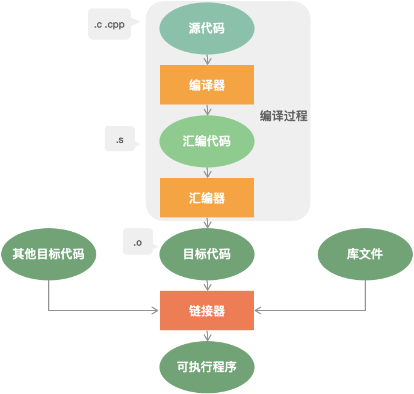

# 编译内存相关
## 编译过程 *高频*
  1. 编译预处理
    处理以#开头的指令
    - define, include
    - 删注释
    - 添加行号 文件标识
  2. 编译，优化
    通过编译器，将源码.cpp文件翻译成 .s 汇编代码
    - 词法分析
    - 语法分析 产生语法树 (以表达式为节点的树)
    - 语义分析
    - 生成.s汇编代码
    - .s 代码优化： 寻找合适的寻址方式，使用位移代替乘法运算，删除多余指令
  3. 汇编
    通过汇编器，将汇编代码.s 翻译成机器指令.o文件
    - 汇编指令与机器指令一一对照翻译
  4. 链接 
    汇编程序生成的.o文件，并不会立即执行，因为可能存在互相调用问题
    链接就是要把.o全部连成一个整体，生成最后的.exe
    通过链接器

## 链接分类
  - 静态链接
    - 就是链接上了代码实体，二进制文件
    - 代码从 静态链接库中 拷贝到 最终的.exe中
    - exe被执行 ，这些代码 被装入到该进程的虚拟地址空间中。
    - 缺点
      - 浪费空间，目标文件更新过了的话，要重新编译
    - 优点
      - 快，代码已经整个都装进去了
  - 动态链接
    - 就是链接个指针的意思，执行时才载入引用的库
    - 代码被放到动态链接库或共享对象的某个目标文件中
    - 链接程序只是在最终的可执行程序中记录了共享对象的名字等一些信息。
    - 在程序执行时，动态链接库的全部内容会被映射到运行时相应进行的虚拟地址的空间。
    - 优点
      - 节省内存，更新方便
    - 缺点
      - 慢，每次执行都要链接


## 内存管理 *高频*
内存分区
- 栈
  - 存放函数的局部变量，函数参数，返回地址。由编译器自动分配和释放。
- 堆
  - malloc 动态申请的内存空间.人为控制分配和释放。程序执行结束还没释放的话，会被os回收。
- 全局, 静态储存区
  - .bss  .data
  - 存全局变量，静态变量。运行结束os会释放。
  - C 语言中， 初始化的放在.bss里面， 初始化的放在.data里面
  - C++ 不区分，全放一起
- 常量储存区
  - .data段
  - 存放常量，不允许修改，运行结束后os释放
- 代码区
  - .text 
  - 存放代码，不允许修改，可以执行
  - 编译后的二进制文件存在这里
- 内存分布 从低地址到高地址
  - .text -> .data -> .bss -> heap -> unused -> stack -> env

```c++
#include <iostream>
using namespace std;

int g_var = 0; // g_var 在全局区（.data 段）
char *gp_var;  // gp_var 在全局区（.bss 段）

int main()
{
    int var;                    // var 在栈区
    char *p_var;                // p_var 在栈区
    char arr[] = "abc";         // arr 为数组变量，存储在栈区；"abc"为字符串常量，存储在常量区
    char *p_var1 = "123456";    // p_var1 在栈区；"123456"为字符串常量，存储在常量区
    static int s_var = 0;       // s_var 为静态变量，存在静态存储区（.data 段）
    p_var = (char *)malloc(10); // 分配得来的 10 个字节的区域在堆区
    free(p_var);
    return 0;
}
```

## 栈和堆的区别 *高频*
- 申请方式
  - 栈由os分配，堆由人申请

- 申请后系统响应
  - 分配栈空间
    - 如果剩余空间大于申请空间则分配成功
    - 否则分配失败栈溢出
  - 申请堆空间
    - 堆在内存中呈现的方式类似于链表（记录空闲地址空间的链表）
    - 在链表上寻找第一个大于申请空间的节点分配给程序，将该节点从链表中删除
    - 大多数系统中该块空间的首地址存放的是本次分配空间的大小，便于释放，将该块空间上的剩余空间再次连接在空闲链表上

- 空间分布
  - 栈在内存中是连续的一块空间（向低地址扩展）最大容量是系统预定好的
  - 堆在内存中的空间（向高地址扩展）是不连续的。

- 申请效率
  - 栈由os分配，申请效率高，但人无法控制
  - 堆由人主动申请，效率低，使用起来方便，但是容易产生碎片。

- 存放的内容
  - 栈存放局部变量，函数参数等临时的
  - 堆存放内容由人控制

## 变量区别
变量有6中作用域 action scope，全局作用域，局部作用域，语句作用域，类作用域，命名空间作用域，文件作用域
- 全局变量
  - 全局作用。在一个源文件中定义，所有地方都管用。如果哪里要去除这个变量，就要用extern重新声明他

- 静态全局变量
  - 文件作用域。只在本文件内管用。由static 关键字修饰。两个不同的文件static了重名的东西，也是分别作用的

- 局部变量
  - 局部作用域。只在函数执行期间存在。函数一次调用执行结束后，就会被撤销，内存被收回。

- 静态局部变量
  - 局部作用域。只被初始化一次，之后一直存在到程序跑完。
  - 和全局变量的区别是，全局变量对所有函数可见。静态局部变量只对自己的函数体始终可见

- 静态储存区：全局变量，静态全局变量，静态局部变量
- 栈：局部变量

- 如果在头文件里定义全局变量，当这个.h被多个文件include时，全局变量就会被多次定义，这是不行的。

## 如何限制类的对象只能在堆上创建，在栈上创建
- 类对象的建立
  - 静态建立
    - 由编译器在栈上分配内存，直接调用类的构造函数，`A a;`
  - 动态建立
    - 使用new, 在堆空间上创建对象。
    - 底层调用 `operator new()`, 在堆空间上找空内存
    - 调用类的构造函数创建对象，`A *p = new A()`
- *限制对象只能建立在堆上*
  - `new` 出来的肯定在堆上
  - 构造函数，析构函数 全部设为protected. 用public的静态函数来构造

```c++
class A{
protected :
    A() {}
    ~A() {}
public:
	// 加static的原因是
	// static 函数可以通过类名调用
	// 非静态函数只能通过对象调用
	// 创建这个东西的时候，还不存在实例，只能通过静态函数调用
	static A *create() {
		return new A();
	}
	void destory() {
		delete this;
	}
};
```
- *限制对象只能建立在栈上*
  - 将 new 设为私有。 因为在堆上创建是用new来创建的，私有了就没办法在堆上创建了。只能在栈上创建
```c++
class A{
private:
	void *operator new (size_t t) {} 		// 函数的第一个参数和返回至都是固定的
	void operator new delete(void *ptr) {}	// 重载new 就要重载delete
public:
	A() {}
	~A() {} 
}
```

## 内存对齐
编译器将程序中的每个“数据单元”安排在字的整数倍的地址指向的内存之中
- 原则
  - struct 变量的首地址能够被其最宽基本类型成员大小与对齐基数中的较小者所整除
  - struct 的每个成员 相对于 首地址的偏移量 offset 都是该成员大小与对齐基数中的较小者的整数倍， 有需要的话 加padding
  - struct 的总大小为 struct最宽的成员 与对齐基数中的较小者的整数倍 有需要的话 在最末成员之后加上填充字节 trailing padding
  - 对齐基数其实要自己指定的 `# pragma pack(8)` or `# pragma pack(4)`
```c++
struct A {
			   // struct 大小
	short var; // 2  byte
	int var1;  // 8  byte: 2(short) + 2(填充) + 4(int)  内存对齐原则，填充2个字节 
	long var2; // 12 byte: 8 + 4 (long)
	char var3; // 16 byte: 12 + 1(char) + 3(填充)
	string s;  // 48 byte: 16 + 32(string)
};
```
- 对齐的原因
  - 有些硬件只能存取对齐数据，不齐的会error
  - 有些硬件不能保证存取没对齐的数据时，是原子操作
  - 没对齐的比较花时间
  - 有些处理器即使能搞非对齐的，但会引发对齐陷阱 alignment trap
  - 有些设备只能对简单的指令非对齐存取，复杂了就不行
- 对齐的优点
  - 方便跨平台移植
  - 提高内存的访问效率，CPU读内存的时候是一块一块读取的

## 类的大小
类的大小是对象的大小。sizeof 得到的是该类型的对象的大小
原则
- 遵循struct对齐的原则
- 与普通成员变量有关，与成员函数 & 静态成员无关。静态成员被所有同类对象共享。
- 虚函数对类的大小有影响。虚函数表指针
- 虚继承对类的大小有影响。虚基表指针
- 空类也有大小，1，留个占位符
```c++
class A {
private:
	static int s_var;	// 静态成员
	const int c_var; 	// 4 字节了
	int var; 			// 8 字节了
	char var1;			// 12 字节了： 8 + 1(char) + 3(填充)
public:
	A(int tmp): c_var(tmp); // 不影响类的大小
	~A() {}					// 不影响类的大小
	virtual void f() {cout << "A::f\n"} // 24 字节: 12 + 8(指向虚函数的指针) + 4(填充)
	virtual void g() {cout << "A::g\n"} // 下面两个不占虚函数表指针的，虚函数表指针就一个 8 字节
	virtual void h() {cout << "A::h\n"} //  
int main() {
	A a(4);  // 构造函数 构造一个 对象a
	A *p;    // 搞个指针
	cout << sizeof(p); 	// 8 字节
	cout << sizeof(a);	// 24 字节
}
};
```

## 内存泄漏
没有释放已经不再使用的内存
- 不是内存没了，是有人占着毛坑不拉屎
- 一般是堆内存泄漏了。堆是由人控制的
- 使用 malloc, calloc, realloc, new 等分配内存时， 要对应地 free 或者 delete。不然就泄漏了
```c++
char *p  = (char *) malloc(10);
char *p1 = (char *) malloc(10);
p = np;  // 一开始p 和 np 各自指向一块内存，之后p 指向 np 的地址了，原来那个内存就没人管了，泄漏了
``` 
- 防止内存泄漏的方法
1. 内部封装 -  封装到类中，构造的时候申请内存，析构的时候释放内存
```c++
class A {
private:
	char *p;
	unsigned int p_size;
public:
	A(unsigned int n = 1) { // 构造函数中分配内存空间
		p = new char[n];
		p_size = n;
	};
	～A() { // 析构函数中释放内存
		if (p != NULL) {
			delete[] p; // 删除字符数组
			p = NULL; 	// 防止出现野指针
		}
	}
	char * getPointer() {
		return p;
	}
};

// 但是对下面这个函数，他创建了两个A 的实例，函数作用域结束时会两次析构，error
void fun1() {
	A a(100);
	A b = a; // 两个A 的实例 会被析构两次
	char *p = a.getPointer();
	strcpy(p, "test");
	cout << p;
}
// 为了避免被析构两次，就要通过计数机制来避免这种情况
// 这个机制就和智能指针差不多
```
- 内存泄漏检测工具
valgrind

2. 智能指针 *超级高频！！！*
智能指针是为了解决 内存泄漏 和 多次释放同一块内存 而提出的东西。封装在<memeory> 头文件中
一共三种智能指针
- *核心是计数机制*
- shared_ptr 共享指针
  - 资源被多个指针指着
  - 用计数机制表明被几个指针共享
  - 通过use_count() 查看被几个人指着
  - 通过release() 释放对资源的所有权，计数减一
  - 计数减到 0 ，自动释放内存，避免泄漏

- unique_ptr 独占指针
  - 资源只能被一个指针占有，该指针不能拷贝构造和赋值, 避免误操作，所有权转移
  - 一个unique_ptr 赋值给另一个unique_ptr ，要通过move() 函数

- weak_ptr
  - 指向share_ptr 的对象， 解决循环引用的问题
  - 和shared_ptr一起使用。weak_ptr可以看成是shared_ptr所管理的资源的观察者，不具有普通指针的行为，仅仅观察资源的使用情况。
  - 当shared_ptr 失效后，weak_ptr也失效
  - 循环引用
    - 有两个对象， A 和 B，都用了share_ptr，A 要等B死了自己才能死，B要等A死了自己才能死。然后就是这两个都死不掉，内存泄露。
  - 要打破循环引用的话，要么就是手动先宰了一个，剩下的该死的就会死了。要么就是用weak_ptr。
  - 为啥能解决循环引用
    - weak_ptr 不会增加引用计数
    - 所以即使weak_ptr还指向一个对象，这个对象的引用计数应该是0的时候就还是0，所以该死的时候就会死
    - 否则一直用share_ptr，引用计数永远降不到0，就永远死不掉。

```c++
// 只能指针实现原理： 计数原理
#include <memory>
template <typename T>
class SmartPtr {
	T *_ptr;
	size_t *_count;
public:
	SmartPtr(T *ptr = nullptr): _ptr(ptr) {
		if (_ptr) {
			_count = new size_t(1);
		}
		else {
			_count = new size_t(0);
		}
	}
	
	~SmartPtr() {
		(*this->_count) --;
		if (*this->_count == 0) {
			delete this->_ptr;
			delete this->_count;
		}
	}

	SmartPtr(const SmartPtr &ptr) { // 拷贝构造， 计数 +1
		if (this != &ptr) {
			this->_ptr = ptr._ptr;
			this->_count = ptr._count;
			(*this->_count)++;
		}
	}

	SmartPtr &operator=(const SmartPtr &ptr) { // 赋值运算符重载
		if (this->_ptr == ptr._ptr) return *this;
		if (this->_ptr) { // 将当前的ptr 指向的原来的空间计数 -1
			(*this->_count) --;
			if (this->_count == 0) {
				delete this->_ptr;
				delete this->_count;
			}
		}
		this->_ptr = ptr._ptr;
		this->_count = ptr._count;
		(*this->_count)++; // ptr指向新的赋值空间，该空间计数++
		return *this;
	}

	T &operator*() {
		assert(this->_ptr == nullptr);
		return *(this->_ptr);
	}

	T *operator->(){
		assert(this->_ptr == nullptr);
		return this->_ptr;
	}

	size_t use_count() {
		return *this->count;
	}
};
```
- unique_ptr 所有权转移
```c++
// A 是个class
std::unique_ptr<A> ptr1(new A());
std::unique_ptr<A> ptr2 = std::move(ptr1);
```

## 使用智能指针的毛病
- 循环引用
  - 定义两个类，parent, child, 定义中分别定义另一个类的对象的共享指针。
  - 程序结束后，两个指针相互指向对方的内存空间，死不掉
```c++
// 循环引用的例子
#include <memory>
using namespace std;
class Child;
class Parent;

class Parent {
private:
	share_ptr<Child> childPtr;
public:
	void setChild(shared_ptr<Child> child) {
		this->childPtr = child;
	}
	void doSth() {
		if (this->childPtr.use_count()) { pass; } // use_count 看看引用计数
	}
	～Parent() {}
};
class Child {
private:
	shared_ptr<Parent> parentPtr;
public:
	void setParent(shared_ptr<Parent> parent) {
		this->parentPtr = parent;
	}
	void doSth() {
		if (this->parentPtr.use_count()) {pass;} 
	}
	~Child() {}
};
int main() {
	weak_ptr<Parent> wpp;
	weak_ptr<Child> wpc;
	{
		shared_ptr<Parent> p (new Parent);
		shared_ptr<Child> c (new Child);
		p->setChild(c);
		c->setParent(p); // 循环引用上
		wpp = p;
		wpc = c;
		cout << p.use_count() << endl; // 2， p 指向parent, c 还指向 p, 两次
		cout << c.use_count() << endl; // 2
	}
	cout << wpp.use_count() << endl; // 1， 上面块里执行完了，没办法杀掉
	cout << wpc.use_count() << endl; // 1
}
```
- 解决循环引用的问题
  - 把循环引用的*环*上的*一个*shared_ptr, 改成weak_ptr， 就行了
  - weak_ptr 不增加引用计数，所以全体往下减的时候，他能减到0, 那大家都能被杀掉

```C++
// weak pointer 解决循环引用
#include <memory>
using namespace std;
class Child;
class Parent;

class Parent {
private:
	// *重点* 这里用weak_ptr 替代 shared_ptr
	weak_ptr<Child> childPtr;
public:
	void setChild(shared_ptr<Child> child) {
		this->childPtr = child;
	}
	void doSth() {
		if (this->childPtr.lock()) { pass; } // weak_ptr还在
	}
	～Parent() {}
};
class Child {
private:
	shared_ptr<Parent> parentPtr;
public:
	void setParent(shared_ptr<Parent> parent) {
		this->parentPtr = parent;
	}
	void doSth() {
		if (this->parentPtr.use_count()) {pass;} 
	}
	~Child() {}
};
int main() {
	weak_ptr<Parent> wpp;
	weak_ptr<Child> wpc;
	{
		shared_ptr<Parent> p (new Parent);
		shared_ptr<Child> c (new Child);
		p->setChild(c);
		c->setParent(p); // 循环引用上
		wpp = p;
		wpc = c;
		cout << p.use_count() << endl; // 2， p 指向parent, c 还指向 p, 两次
		cout << c.use_count() << endl; // 1， c 指向 Child, 但 p 指向 c 的弱指针，不增加计数， 还是1
	}
	cout << wpp.use_count() << endl; // 0 都杀掉了
	cout << wpc.use_count() << endl; // 0
}
```

## 内存池
- 在真正使用内存之前，预先申请分配一定数量、大小预设的内存块留作备用
- 当有新的内存需求时，就从内存池中分出一部分内存块
- 若内存块不够再继续申请新的内存，当内存释放后就回归到内存块留作后续的复用
- 使得内存使用效率得到提升，一般也不会产生不可控制的内存碎片。

### 内存池设计

- 预申请一个内存区chunk，将内存中按照对象大小划分成多个内存块block
- 维持一个空闲内存块链表，通过指针相连，标记头指针为第一个空闲块
- 每次新申请一个对象的空间，则将该内存块从空闲链表中去除，更新空闲链表头指针
- 每次释放一个对象的空间，则重新将该内存块加到空闲链表头
- 如果一个内存区占满了，则新开辟一个内存区，维持一个内存区的链表，同指针相连，头指针指向最新的内存区，新的内存块从该区内重新划分和申请