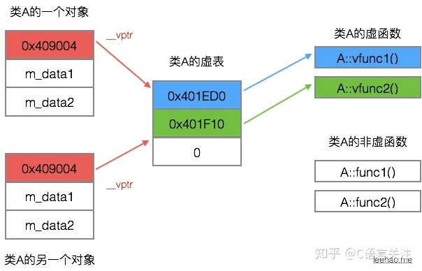
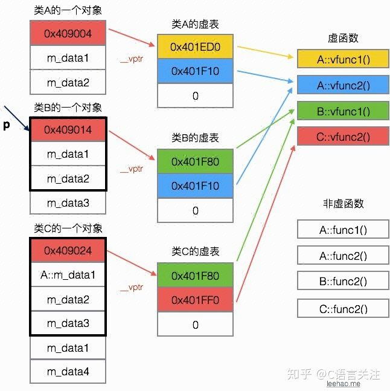

# 面向对象 *高频*

## 对象基础
### 编译器自动生成的函数 *我觉得要紧*
  - 一个空类， 的对象，1个字节大小，存这个对象的指针
  - 但是编译器还是会默认生成6个成员函数
```c++
class A {
public:
	A() {}; 					// 缺省构造函数
	A(const A &tmp) {}; 		// 拷贝构造函数
                                // 拷贝构造函数必须用引用，否则会无限递归
                                // 因为如果不是用引用 A(const A tmp) 这样传参
                                // 就要生成一个 tmp 的临时的东西，这个又要调用拷贝构造函数，然后无限递归下去
	~A() {};					// 析构函数
	A &operator=(const A &tmp) {} 	// 赋值运算符
	A *operator&() {return this;}	// 取地址运算符
	const A *operator& const {return this;}; // const 取地址运算符
};
```

### 构造函数 & 析构函数
  - 构造函数
    - 显式构造
      - `People ben  = People("ben", 183, 70);` 
    - 隐式构造
      - `People ben ("ben", 183, 70);`
      - `People ben; // 这个也是构造了，不是空的，用默认构造函数`
    - 显示隐式 两者等价
    - new `People *ben = new People("ben", 183, 70);`
      - 创建一个People对象，把 new 返回的地址 赋值给 ben 指针
    - 默认构造函数
      - 不给任何实参的构造函数
      - `class A {int a; public: A() {a = 10}  };`
    - 禁止构造函数的使用
      - 给构造函数加上delete 
      - `class A { A(int x) = delete; };`
    - *构造函数不要搞成虚函数*
      - 虚函数要访问一个对象的内存空间，才能通过虚表指针调用。
      - 但你构造之前，还没有对象，就没有虚表指针，也就没办法调用构造函数。矛盾。

  - 析构函数
    - *最好写成virtual，方便子类继承*
      - *为了爹也能用儿子的方法*
      - 当基类的指针绑定到派生类的对象时，如果基类的析构函数不是虚函数，派生对象销毁时，只能调用基类的析构函数
      - 于是只能将基类的成员释放掉，派生类里的东西还在。内存泄漏。
      - 基类`virtual`了， 当基类的指针绑定子类对象时，析构函数会先杀儿子，后杀爹，全杀了


### 派生类的构造函数的执行顺序
1. 抽象基类的构造函数
   - 多个抽象基类，则按照继承顺序执行
2. 基类的构造函数
   - 多重继承，按照继承顺序执行
3. 成员变量里面的 对象的 构造函数
   - 按出现顺序
4. 派生类自己的构造函数
  - 析构函数的执行顺序相反

- 如何禁止一个类被实例化
  1. 在类里面定义一个纯虚函数，这就变抽象类了，就不能实例化了
  2. 构造函数弄成private


### 类成员的初始化方式
  - 赋值初始化
    - 在构造函数的函数体内， {}内，初始化
  - 列表初始化
    - 构造函数的冒号后，使用初始化列表初始化 `Treenode(int x): val(x) {}`
  - 区别
    - 对象成员变量的初始化，发生在进入构造函数本体{}之前
    - 赋值初始化是在 所有的数据成员 被分配内存空间之后 才进行
      - 在构造函数中做赋值操作，会产生临时对象。降低效率
    - 列表初始化，在给数据成员分配内存空间时，就进行初始化。就是在函数体执行前，就初始化完成。
      - 没有临时对象的产生。效率高
  - 如何减少构造函数的开销？
    - 就是用列表初始化的方式


## 三大特性
- 封装
  - 将具体的实现过程和数据封装在类里，只能通过接口进行访问，降低耦合性
  - 数据和代码不分离， 对象是软件实体。
  - 成员函数隐藏实现细节，内部改变时，和外界没有耦合。
- 继承
  - 子类继承父类的特征和行为。
  - 子类 有父类的 非private的方法，成员变量。
  - 子类可以对父类的方法 *重写* (除了final修饰的成员变量或函数)
  - 复用父类代码。新功能只要增加子类新方法就行了。以前的都不用改。

- 多态
  - 不同继承类的对象，对同一消息作出不同的响应。
  - 基类的指针 指向 派生类的对象
    - 使得基类指针呈现不同的表现方式
    - *基类指针可以指派生类对象， 派生类指针不能指基类对象*
    - 通过基类指针调用基类和派生类中的同名「虚函数」时
      - 若该指针指向一个基类的对象，那么被调用是 基类的虚函数
      - 若该指针指向一个派生类的对象，那么被调用 的是派生类的虚函数
    - 说白点就是调用哪个虚函数，取决于指针对象指向哪种类型的对象。
      - 设计接口的时候，就不用给每个子类都弄一个接口了
      - 接口直接 接受一个 基类指针
      - 传进来的 是不同的 子类对象
      - 根据不同的子类对象，就可以调用这个子类对象的虚函数，做相应的东西
      - 否则，如果不是 父类指针 指向 子类对象，而是很死板的 什么对象就传什么指针，那就要每个都实现一个接口，烦的要死
      - 运行时多态
        - *先把接口写成接收动物，具体看传过来是猫还是狗，再具体反应*
      - https://zhuanlan.zhihu.com/p/104605966

- 编译时多态 && 运行时多态
  - 编译时多态
    - 发生在*模板* 和 *函数重载* 中
  - 运行时多态
    - 发生在*继承体系*
    - 通过基类的指针，访问派生类中的虚函数
  - 不同点
    - 时期： 一个是编译期，一个是运行时
    - 实现方式： 一个是泛型编程/重载， 一个是虚函数

- 面向过程编程
  - 以过程为中心
  - 数据存在变量里面，与过程分离，使用时传参
  - 缺点
    - 数据与代码分离
    - 当数据结构变化时，代码要跟着改，更改会出错遗漏，麻烦

- 面向对象
  - 对象是软件实体。
  - 数据和代码不分离。
  - 成员变量，成员函数，都在一起。改动范围确定。
  - 访问级别也有限制，保护成员变量。
  - 成员函数隐藏实现细节，内部改变时，和外界没有耦合。
  - *把数据和操纵数据的方法打包起来*


### 多态与其实现 *超级重点*
- 定义
  - 多态就是不同继承层次的对象，对同一消息，作出不同反应
  - 基类的指针，指向，或绑定到派生类的对象，使基类的指针呈现不同的表现方式

- 实现方式
  - *虚函数*
  - 虚函数的地址保存在虚函数表里。
  - 虚函数表 的地址，保存在 含有虚函数的类的实例 的内存空间中。*虚函数指针在实例的内存空间中*
  - *虚指针调用关系： this -> vptr -> vtable -> virtual function*

- 虚函数表
  - 存放的内容
    - 类的虚函数的地址
  - 建立时间
    - 编译阶段
  - 虚表指针保存的位置
    - **虚表指针存放在对象的内存空间中 最前面的位置**，保证正确取到需函数的偏移量。
  - 当子类没有虚函数，但父类有虚函数时，子类也会创建一个虚表，存放父类的虚函数的指针


  - 当有子类继承时
    - A 类两个虚函数 vfunc1, vfunc2，B 继承 A 重写 vfunc1, C 继承 B 重写 vfunc2 
```c++
class A {
public:
	virtual void vfunc1();
    virtual void vfunc2();
    void func1();
    void func2();
private:
    int m_data1, m_data2;
};

class B : public A {
public:
    virtual void vfunc1();
    void func1();
private:
    int m_data3;
};

class C: public B {
public:
    virtual void vfunc2();
    void func2();
private:
    int m_data1, m_data4;
};
```


	- 多重继承
    	- 有几个爹，子类就有几个虚表指针
```c++
class Dad1 {
public:
	virtual void f() {pass;}
	virtual void d1() {pass;}
}
class Dad2 {
public:
	virtual void f() {pass;}
	virtual void d2() {pass;}
}
class Dad3 {
public:
	virtual void f() {pass;}
	virtual void d3() {pass;}
}
class Son: public Dad1, public Dad2, public Dad3{
public:
	virtual void f() {pass;}
	virtual void s1() {pass;}
}
int main() {
	Dad1 *p1 = new Son();
	Dad2 *p2 = new Son();
	Dad3 *p3 = new Son();
}
```

- 实现过程
  - `virtual`声明虚函数
  - 每个虚函数的class 都有个虚函数表
  - 每个对象，都有个虚函数表指针，指向虚函数表
  - 虚函数表 <-> 类        虚表指针 <-> 对象
  - 基类的指针指向派生类对象时， 当基类指针调用虚函数时，基类指针指向派生类的虚表指针
    - 由于该虚表指针指向派生类的虚函数表， 通过遍历虚表， 寻找对应的虚函数

- 纯虚函数 *高频*
  - 只要含有纯虚函数的类，是抽象类
  - 只有接口，没有具体实现方法。 
  - e.g. 动物.叫() -> 狗.叫() 
  - 抽象类 不能创建对象 不能作为返回类型  你可以创建一条狗， 不能创建一个实体的动物
  - 要求任何派生类都要实现这个方法
  - 派生类中， 如果有纯虚函数没实现，就还是抽象类
  - 纯虚函数可以在派生类中被重写
  - `virtual void function()=0; `

- 多重继承，菱形继承 *高频*
  - 菱形继承
    - A 派生出 B1, B2
    - C 又多重继承 B1, B2
    - C 就会间接保存两份 A， 因为B1 B2都继承了一套A 的东西
    - C 在调用继承自A的东西时，会产生命名冲突， 到底用B1 那里拿来的A，还是B2那里拿来的A
  - 解决办法
  	1. 声明出现冲突的成员变量来源于哪个爹
       - `B1::var = tmp;`
    2. 虚继承
        - 只保留一套爷爷的东西 (间接基类)
        - 两位爸爸都是虚继承爷爷，儿子正常继承爸爸 (直接基类)
	```c++
	class A {
	public: 
		int a;
	}
	class B1: virtual public A {
	public:
		int b1;
	}
	class B2: virtual public A {
	public:
		int b2;
	}
	class C: public B1, public B2 {
	int c;
	public:
		void f1(int x) {a = x;}
		void f2(int x) {b1 = x;}
		void f3(int x) {b2 = x;}
	}
	``` 


## 重载，重写和隐藏的区别 *高频*
- 重载
  - 同一可访区内被声明的同名函数，具有不同的参数列表
  - 参数的类型，个数，顺序不同，即为不同的参数列表
  - 根据具体传参情况，判断调用哪个函数。
  - 重载只看参数列表是不是不同，不看返回类型
  - *同一个名字，换一个写法。记不清就记 重载小于号*
```c++
class A {
public:
    void fun(int tmp);
    void fun(float tmp); // 重载 参数类型不同
    void fun(int tmp, float tmp2); // 参数个数不同， 重载
    void fun(float tmp, int tmp2); // 顺序不同也可以重载
    // int fun(int tmp);  // 这个不行，你参数列表一样的，不能重载。 重载不看返回类型
};
```
- 重写
  - 子类覆盖父类的函数。
  - 函数名，参数列表，返回类型，*必须一致*， 只有函数体不同
  - 子类被调用时，会调用派生类的重写函数，不会调用 被重写函数
```c++
class Dad {
public:
    virtual void fun(int tmp) { cout << "Dad::fun(int tmp): " << tmp << endl;}    
};

class Son: public Base {
public:
    // 重写基类的函数, 函数签名完全一致
    virtual void fun(int tmp) { cout << "Son::fun(int tmp): " << tmp << endl;}
}
int main() {
    Dad *p = new Son();
    p->fun(3); // "Son::fun(int): 3"
}
```
- 重载和重写的区别
  - 范围
    - 重载发生在同一个类的内部
    - 重写发生在父类 和 子类 之间
  - 参数
    - 重载要同样的函数名， 函数列表要有不同， 返回值无所谓
    - 重写要函数签名完全一样。被重写的要virtual
  - virtual
    - 重写的父类函数一定要virtual
    - 重载的可以有，可以没有

- 隐藏
  - 子类的函数 屏蔽 父类的同名函数。
  - 只要同名就会被隐藏，不管参数列表一样不一样
```c++
class Dad {
public:
    void fun(int tmp, float tmp1) { cout << "Dad" << endl;}
    virtual void haha(int tmp, float tmp1) {cout << "haha" << endl;}
};

class Son: public Dad {
public:
    // 隐藏父类的同名函数。 他没让重写
    void fun(int tmp) { cout << "Son" << endl;} 
    
    // 参数列表不同了，没办法重写，就会隐藏 
    virtual void haha(int tmp) {cout << "xixi" << endl;}
}

int main() {
    Son s;
    s.fun(1); // 正常 son
    s.fun(1, 0.01); // 不行，父类的被隐藏了
    s.Dad::fun(1, 0.01); // 要用父类的， 就要声明一下
    return 0; 
}
```
- 隐藏和重写重载的区别
  - 范围
    - 隐藏发生在子类和父类之间， 和重载不同
  - 参数
    - 隐藏只看函数名是否相同
    - virtual 修饰的函数，如果参数列表不同，就会直接隐藏基类的，而不发生重写


## 深拷贝 浅拷贝 *高频*
如果一个类拥有资源，在复制的时候， 资源重新划拉，就是深拷贝，否则就是浅拷贝
- 深拷贝
  - 新对象 和原对象 占用不同的内存空间。
  - 既拷贝储存在栈空间中的内容，又拷贝堆空间中的内容
- 浅拷贝
  - 新对象 和原对象，占用同一块内存空间
  - 仅拷贝栈空间中的内容
  - 坏处
    - 两个对象，指向同一个空间
    - 析构的时候，第一个已经释放了那块空间，第二个又去释放一遍，就崩溃报错了。
- 怎么搞
  - 看拷贝构造函数怎么定义
  - 默认的拷贝构造函数是浅拷贝的
  - 你要深拷贝要自己定义清楚
```c++
class A{
private:
	int *p;
public:
	A (int x) {
		p = new int(x);
	}
	~A() {
		if (p) delete p;
	}
	// 定义拷贝构造函数
	// 如果不自己定义，编译器给你弄个默认的浅拷贝的
	A (const A &tmp) {
		// 重新开一块空间，深拷贝
		p = new int(tmp.p);
	}
};
int main() {
	A a1(10);  // 初始化一个a
	A a2 = a1; // 调用拷贝构造函数 来构造a2
}
// 代码块执行完毕，析构
// 如果是浅拷贝，同一块内存释放两遍， 崩溃
// 拷贝构造函数是深拷贝就不会崩溃
```

## 友元函数
  - 为了让private, protected的东西能够被 非我这个家族的人访问。
  1. 可以定义一个普通函数 为 我的友元函数。
     - `friend function(); // 声明一下这个函数是我基友，他可以访问我的private`
  2. 可以定义另一个类 为我的友元类
	 - `friend class Other; // Other 就能访问我的private的东西了`
  
  - 友元关系不会被继承

## 比较结构体是否相等
- 不能直接 ==， 比的是指针
- 不能memcpy(), 这个是逐字节比较，可能会因为内存对齐 或 padding的原因，产生不同
- 可以写个函数，比较每个成员变量
- 可以重载'=='运算符，实现结构体比较