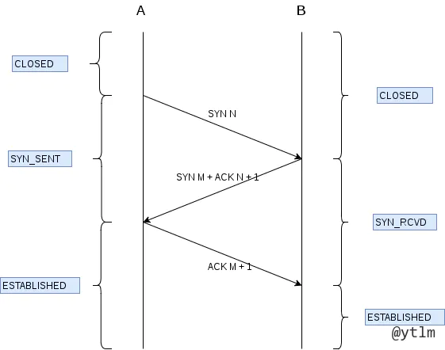

# 计算机网络

7层网络模型
应用层： 		HTTP， HTTPS，FTP， POP3，DNS
表示层: 		数据格式化，数据加密: XDR, ASN.1, SMB, AFP, NCP
对数据格式进行编译，如处理成文字，图片，视频等。
解压缩，解密等
会话层：		ASAP, TLS, SSH, RPC, NetBIOS, ASP
建立会话，身份验证，鉴权等；维护保持会话；关闭会话
传输层：		TCP, UDP, RTP, SCTP, SPX, ATP 
提供进程间逻辑通信，向高层屏蔽网络层细节。
网络层：		IP，ICMP, IGMP, IPX, ARP
将网络地址翻译成对应的物理地址。选择网络间的最短路径。
数据链路层：	MAC, Ethernet, 令牌环, IEEE 802.11
隔离物理层和网络层。把物理层发来的比特，打包成包（帧适配），丢给网络层。
把数据帧，拆包成装为比特流，给物理层。
通过差错控制、流量控制方法，使有差错的物理线路变为无差错的数据链路。提供物理地址寻址功能。
交换机工作在这一层。
物理层：		线路, 无线电, 光纤, 信鸽

简述从输入网址到浏览器显示的过程
1、浏览器的地址栏输入URL并按下回车。
2、浏览器查找当前URL是否存在缓存，并比较缓存是否过期。3、DNS解析URL对应的IP。
4、根据IP建立TCP连接（三次握手）。
5、HTTP发起请求。
6、服务器处理请求，浏览器接收HTTP响应。
7、渲染页面，构建DOM树。
8、关闭TCP连接（四次挥手）

TCP 为什么是三次握手四次挥手
建立TCP连接， 同步双方的 序列号 确认号
第一次握手：（SYN = 1, seq = x） synchronize msg, sequence num 序列号
client 向 server 发送 SYN, 等待确认 
 client 进入SYN_send 状态
SYN = synchronize sequence number
第二次握手：（SYN = 1, ACK = 1, seq = y, ACK = x+1）
server 收到SYN
回复client : SYN + ACK
进入SYN_RECV状态
第三次握手:  （ACK = 1,  ACK = y+1）
client 收到 SYN +ACK,
向server 发 ACK
完成tcp 连接
超时重传机制：
任意一次握手中，如果一段时间没收到回复，发送方就会超时重传，直到收到确认
为啥要三次握手
为啥不是2次握手：
“为了防止已经失效的连接请求报文段突然又传到服务端，因而产生错误”一个包 client发出之后 在一个地方憋了很久 才被server收到其实client 已经不要建立连接了如果只要两次握手 server此时收到包 就会开连接但其实client 已经没有声音了于是就开了个空的
如果用三次握手：
当server收到这个包时 给client发SYK，ACK，client 收到，对了下号头，发现不对，就不会回复。server没有接受到回音，就不会开这个连接
为啥不是4次握手
两次握手只能保证单向链路是可以通信的，理论上来说，要保证双向链路可以通信需要四次握手，但实际上服务端给客户端的 SYN 和 ACK 数据包可以合为一次握手，所以实际上只需要三次握手即可。

TCP 四次挥手
第一次挥手：
断开方发送 FIN 给被动方
主动方不再发数据  坐等回音 
进入FIN_WAIT1 状态
第二次挥手：
被动方还有东西要发
先给主动方发送ACK  省的主动方反复发
server 进入Close_Wait
client 关闭连接 进入FIN_wait2状态 
第三次挥手：
被动方把剩下的发完
给主动方 发送 FIN   告诉我这边已经完事了
被动方进入 Last_ack
第四次挥手:
client 收到FIN, 发送 ACK
进入 TIME-wait 状态
client等待2MSL
等收到server的FIN之后 	
双方进入Close
2MSL
maximum segment lifetime 就是一个包的寿命
client的最后一个包发出来的时候	server 还在last ACK 状态， 还没关
最后这个包发出去马上就把自己关了
如果这个包丢了  server就关不掉了
所以要等一个来回的周期
在这个周期里 server 没收到那个丢掉的包 就会重新发一个FIN
在这个周期里 client 如果收到一个新的FIN 说明之前那个丢了
就要再发一遍
总之 要等2MSL 这个时长保证了对方能正常关闭

为什么要挥手4次
因为server 收到FIN 关闭请求的时候 很可能不能马上就关闭 所以要多出一步 等剩下的处理干净了 再发FIN 确认我这里也好了
所以比建立连接多一步
为什么4次挥手时，客户端最后还要等待 2MSL(Maximum Segment Lifetime)？
如果客户端最后一个ack 发出去丢了的话， 服务端会一直收不到，就超时重传一次FIN
发出去的ack 要活一个msl，服务端超时重传过来的要活一个msl。
2msl 内，客户端没收到超时重传来的FIN，说明对面已经关掉了，自己这里就能关掉
2msl 内，客户端收到对面超时重传来的FIN，说明自己这里也要重传。
整个过程
C : 我没话说了
S：好的，等我说完
S：我说完了
C： 好的

TIME_CLOSE 和 TIME_WAIT 的状态和意义
time_wait：
主动关闭方在收到被关闭方的FIN后会处于并长期（2个MSL时间，建议值是2min）的状态，大约是1-4分钟。然后由操作系统回头连接并将TCP连接设为CLOSED初始状态。

close_wait：
是被动关闭连接形成的，被动端收到主动端的FIN时候，发送ACK确认，并进入CLOSE_WAIT的状态，如果不指定close()方法，那么就不能从 CLOSE_WAIT 迁移到LAST_ACK，则系统中会有很多的CLOSE_WAIT状态的链接

TCP 如何保证可靠传输
0. 三次握手：保证双方连接接上
每个包都编号，接收方收到后排序
checkSum：检测数据是否有变，变了就丢掉要求重发
流量控制：可变滑动窗口同步双方速率
拥塞控制：不要堵了网络
超时重传：收不到ACK就重发
四次挥手：保证该传的都传干净

为什么不能是两次握手
如果有个一堵了很久的开通要求，其实已经不要了，如果只有两次握手，对面还是会开起来。但这个tcp已经不要了。浪费

TCP 在握手阶段怎么管理客户端的连接？
TCP 在握手阶段服务端维护了两个队列：半连接队列和全连接队列
在客户端发起第一次握手时，服务端会把此请求放入半连接队列，并回复 SYN+ACK
在客户端回复 ACK，也就是第三次握手时，服务端将此连接加入到全连接队列
如果全连接队列满，则服务端的处理方式和 tcp_abort_on_overflow 参数的设置有关
如果该参数为 0，则丢弃该 ACK，如果为 1 则发送 RST 到客户端，直接放弃此次连接。

流量控制和拥塞控制
流量控制（滑动窗口）
如果发送方发得太快，对面来不及接受，就会丢分组
流量控制就是控制发送方速度，使不丢包 + 有序接收
接受方每次收到包，告诉对方自己还剩多少缓存，即告诉对面自己的窗口大小
当接收方的窗口为0的时候，就停发，防止大量丢包
发送方停发之后，开个循环定时器，隔一会看看你好了没，好了我接着发
TCP是全双工的，所以有两个滑动窗口。
发送窗口大小就是无需等待确认而可以继续发送数据的最大值
拥塞控制：
慢开始，拥塞避免
快重传，快恢复
一开始先试探网络拥塞程度，没有丢包就倍增，丢包则减半。减半后开始线性增加。
丢包的判据是：收到三个重复的ACK，或超时重传超时了
超时重传就是：发了一个包时候开始倒计时，没收到ACK就是超时了
快速重传就是：连收3个重复的ACK，就不等倒计时了，直接发丢的那个（ACK的下一个

新的拥塞控制算法： Google BBR:
周期性地探测网络容量，取一段时间内的带宽极大值和极小值，将其乘积作为拥塞窗口的大小。使拥塞窗口的值与网络容量保持一致。

CRC 循环校验的算法
如何使用 UDP 实现可靠传输
UDT
RUDP == reliable UDP

SYN FLOOD 是什么
就是给服务器发一堆SYN的连接请求，让服务器半开一堆连接，占掉所有窗口。
怎么解决
缩短SYN timeout 的时间
记录IP， 收到同一个ip 的重复syn，则全部丢掉

DNS
基于UDP，根据域名，解析出ip地址
解析过程
先找缓存，缓存里没有，发请求给dns服务器
本地DNS 服务器在自己区域里找，找到返回没找到问根dns 服务器
根服务器告诉这个本地DNS服务器，应该找另一个谁
一层一层向下找
找到之后本地dns服务器向客户返回ip， 同时大家都缓存

HTTPS 的原理，客户端为什么信任第三方证书
首先客户端通过URL访问服务器建立SSL连接。
服务端收到客户端请求后，会将网站支持的证书信息（证书中包含公钥）传送一份给客户端。
客户端的服务器开始协商SSL连接的安全等级，也就是信息加密的等级。
客户端的浏览器根据双方同意的安全等级，建立会话密钥，然后利用网站的公钥将会话密钥加密，并传送给网站。
服务器利用自己的私钥解密出会话密钥。
服务器利用会话密钥加密与客户端之间的通信。
https 的 s 是啥
TLS (transport layer security), 本来是用的 SSL， 后来废弃了，全部改成 TLS
保障了：
内容加密： 客户端到服务器的内容加密传输，第三方看不到明文
身份认证： 通过校验保证客户端访问的是对的那个服务器
数据完整性： 防止内容被第三方篡改
对称加密：
加密和解密用同一个密钥，密钥被破了就完蛋了。而且密钥也要在http里传输的，很容易截取被破。
非对称加密：
加密和解密用不同的密钥。公钥对数据加密，私钥对数据解密。
网络上传输公钥。
私钥保存在本地，用于解密被公钥加密过的密文。
这种操作很耗资源，很慢。
https的加密方式
客户端使用对称加密，生成key, 对传输的数据进行加密
再使用非对称加密中的公钥，对key进行加密。
就是对钥匙加密了，解密时不用把所有东西都解密，只解密一个钥匙就可以了
被截获时，由于没有私钥，解密不了钥匙，整个也没办法解密。
总结，加密钥匙，钥匙加密内容。
对称加密key 哪里来的？
客户端随机产生的
公钥私钥哪里来的？
CA 数字证书里给的。
HTTPs 和 HTTP 的区别

HTTP 明文传输，数据都是未加密的，安全性较差
HTTPS（SSL+HTTP） 数据传输过程是加密的，安全性较好。
HTTPS 经由 HTTP 通信，利用SSL/TLS加密数据包。
http 80 端口, https 443 端口。
https 工作方式：
tcp 三次握手
客户端验证服务器数字证书
DH 算法协商对称加密算法的密钥，hash算法的密钥
SSL 安全加密隧道协商完成
网页以加密的方式传输，用协商的对称加密算法和密钥加密，保证数据机密性
用协商的hash算法进行数据完整性保护，保证数据不被篡改
使用 HTTPS 协议需要到 CA（Certificate Authority，数字证书认证机构） 申请证书，一般免费证书较少，因而需要一定费用。
HTTP 页面响应速度比 HTTPS 快，主要是因为 HTTP 使用 TCP 三次握手建立连接，客户端和服务器需要交换 3 个包，而 HTTPS除了 TCP 的三个包，还要加上 ssl 握手需要的 9 个包，所以一共是 12 个包。
http 和 https 使用的是完全不同的连接方式，用的端口也不一样，前者是 80，后者是 443。
HTTPS 其实就是建构在 SSL/TLS 之上的 HTTP 协议，所以，要比较 HTTPS 比 HTTP 要更耗费服务器资源。

简述cookie
http 本身是无状态的，为了保存状态，引入cookie
cookie 由服务端产生，客户端保存。
客户端再次访问的时候，服务器可以根据cookie来鉴权，或做个性化推送，免密登录等。
cookie <= 4 KB， 一个站点20个cookie

简述session
session 存在服务器里， 给客户端做标识。用户登出后销毁。
比cookie安全，但是不容易做负载均衡。
HTTP 方法了解哪些
GET:请求指定的页面信息，并返回实体主体。
POST:向指定资源提交数据进行处理请求（例如提交表单或者上传文件）。数据被包含在请求体中。POST请求可能会导致新的资源的建立和/或已有资源的修改。
HEAD:类似于get请求，只不过返回的响应中没有具体的内容，用于获取报头
PUT:从客户端向服务器传送的数据取代指定的文档的内容。
DELETE:请求服务器删除指定的页面。
get 和post的区别
get是幂等
post 向资源提交要被处理的数据，刷新会使数据被重复提交
post在发送数据前将请求头 发给服务器进行确认，确认之后再发送真正的数据
HTTP 异常状态码知道哪些
1XX- 信息型，服务器收到请求，需要请求者继续操作。
2XX- 成功型，请求成功收到，理解并处理。
3XX - 重定向，需要进一步的操作以完成请求。
301 永久重定向
302 临时重定向
304 资源未修改，可以用缓存
4XX - 客户端错误，请求包含语法错误或无法完成请求。
400 Bad Request - 客户端请求有语法错误，不能被服务器所理解
401 Unauthorized - 请求未经授权，这个状态代码必须和WWW-Authenticate报头域一起使用
403 服务器禁止访问资源
404 找不到这个东西
5XX - 服务器错误，服务器在处理请求的过程中发生了错误。
500 - 服务器内部发生了不可预期的错误
502 - Bad Gateway 充当网关或代理的服务器，从远端服务器收到了一个无效请求
503 Server Unavailable - 服务器当前不能处理客户端的请求，一段时间后可能恢复正常。
504 Gateway Timeout 网关超时了
TCP 如何保障数据包有效
在数据包层面：校验和
在数据包传输层面：序列号、确认应答、超时重传
在流量控制层面：拥塞控制
校验和
计算方式：在数据传输的过程中，将发送的数据段都当做一个 16 位的整数。将这些整数加起来。并且加上进位，最后取反，得到校验和。

滑动窗口
tcp
维持发送方 / 接收方的缓冲区。
解决丢包，重复包，出错，乱序等问题
分为接受窗口，发送窗口
发送方的滑动窗口

已发送未 ack 的包收到ack时，右滑
窗口 ： 无需等待确认应答，而可以继续发送数据的最大值
tcp 报头里有个字段叫window， 就是窗口大小
接收端告诉发送端，自己还有多少缓冲区可以接受数据。发送方就按这个来，防止接受方处理不过来。
下图，发完可用窗口后，就不能再发了，只能等前面的ack来了

收到5个ack， 左端窗口右移，又可以发送了

接收方窗口
分三个接收部分，用两个指针划分
RCV.WND: 表示窗口大小，会在 tcp 报头里发给对方
RCV.NXT： 指针，指向期房从发送方送来的下一个数据字节的序列号
未收到且不可以接收的数据，从rcv.nxt 和 rcv.wnd 可以计算出来

接收窗口和发送窗口大小不相等，但是是差不多的

整个过程就相当于，发送方给接收方说，“你好，我找马冬梅”。
接：太多了，处理不过来，接收2个
发：你好
接：收到，再发5个
发：我找马冬梅
接：丢了，马什么梅?发2个
发：我找
接：收到，发3个
发：马冬梅
接：丢了，2个
发：马东
接：收到，1个
发：梅
接：收到，你好，我找马冬梅

重传机制
超时重传
数据包丢失 / ack 丢失时，超时重传
超时判定为 略大于rtt, 往返时间
rtt 是采样加权平均的
超时重发的数据也超时的时候，说明网络很烂，则超时时间加倍
快速重传

每次回复ack时，都是回复缺的最早的那个
连收三个ack，说明这个包丢了，立刻重传

拥塞控制
网络整体交通情况不行的时候，继续发送只会加剧拥塞。
tcp 设计为，当整体环境不好时，自我牺牲，降低发送
拥塞窗口 cwnd，发送方维护的状态变量
发送窗口 = min (拥塞窗口，接受窗口)
只要网络中没有出现拥塞， cwnd就会增大
网络中出现了拥塞，cwnd就会减少
当发生了超时重传时，就会认为网络发生了拥塞
慢启动
发送方每收到一次ack，cwnd 就 翻倍
拥塞避免
翻倍到超过阈值，开始拥塞避免，进入线性增长
拥塞发生
发生超时重传时，判定为拥塞，cwnd重置为1，阈值减半
快速恢复
若发生快速重传(连收3个相同ack)，说明不是很堵，就把阈值设为当前cwnd的一半。当前cwnd减半，并进入线性增长。

https://www.cnblogs.com/xiaolincoding/p/12732052.html

HTTP
http协议构建于 TCP/ IP 协议之上，是一个应用层协议，端口号80
http 是无连接，无状态的

请求数据

响应数据

http 方法
get
head
post
delete
options

状态码

状态码流程

