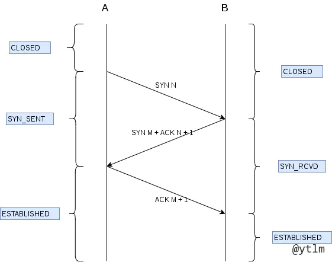
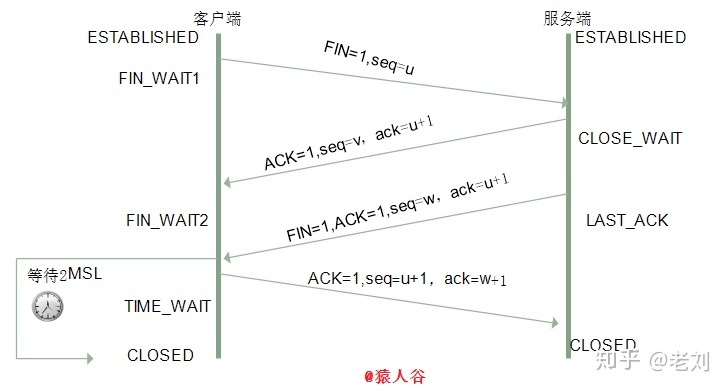
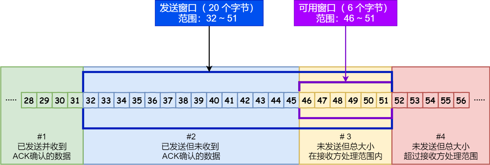
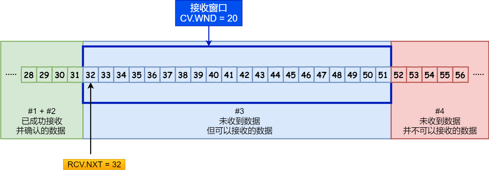

# tcp udp
## tcp 三次握手

1. 第一次握手
- 标志位 SYN，表示请求连接          synchronize msg
- seq = x                        sequence num 序列号
- 发完进入 syn-sent 状态
2. 第二次握手
- 回复 标志位为 SYN & ACK
- seq = y           测试服务器发送能力
- ack = x + 1       确认能正常接受客户端数据
- 进入 syn-recv 状态
3. 第三次握手
- 标志位 ACK
- seq = x + 1， 收到服务端的ack，将其值作为自己的序号值
- ack = y + 1, 收到服务端seq, +1 返回ack
- 客户端进入established
4. 服务端
- 服务段收到ack, 得知服务端到客户端的信道正常，进入established

### 两次握手 四次握手
- 两次握手
  - client 发的第一次握手 在一个地方憋了很久， 连接释放后，才到server
  - 如果两次握手，server 开了tcp，但client 不会应答这个tcp
  - server 却会傻等 client发来数据
  - 浪费资源
- 为了保证信道双工
  - 双方需要确保自己的 收 发 能力
  - 一次syn -> ack 可以确保自己的发送 对方的接受能力
  - 需要 2次双向 syn -> ack 来确保 双方都有 收发能力
  - 当中的一次 ack 和 syn 合并为一步
  - 三次握手 是保证信道双工的 最少要求

### 三次握手 每次握手对方没收到 分别会怎么样
1. 第一次
- server 没收到 client syn
- server 啥都不会干
- client 收不到ack 超时重发syn
- 反复重发 直到超过 最大重传次数
2. 第二次
- client 没收到 server 的 ack + syn
- client 还是超时重发 syn
- server 阻塞在半连接队伍
3. 第三次
- server 没收打 client 给的ack
- server 超时重传 ack + syn
- 如果死活连不上
- server 端连接失败
- 但client 觉得自己成功了，开始给server 发包
- 但server 这收到包 不会接受的。 会给client发RST, 让client重置reset

## 超时重传
任意一次握手中，如果一段时间没收到回复，发送方就会超时重传，直到收到确认

## tcp 四次挥手

1. 第一次挥手
- 客户端断开连接
- *标记位为 FIN*
- 序列号 seq = u
- 进入 fin-wait-1 阶段， 半关闭， 停止向服务器发送数据
2. 第二次挥手
- 服务器进入 close wait 状态
- *标记位 ACK*
- seq = v
- ack = u + 1
- 准备把还没发完的发完
- 客户端收到这个ack， 知道服务器知道我要关了，进入fin_wait2的状态
3. 第三次挥手
- 服务端发完所有剩下的了
- *标记位 FIN ACK*
- seq = w
- ack = u + 1
- 发完进入last ack状态， 等客户端关闭
4. 第四次握手
- 客户端收到 last ack
- 进入time wait 状态，等待2MSL
- 发送报文*ACK*
- seq = u + 1
- ack = w + 1
5. 服务端 知道 客户端关了，自己也关了，进入closed.

### 为什么要四次挥手
- client 发送 FIN 的时候， server 还有东西没发完，不能马上断开
- server 就先发个ack，告知 知道你要断开了 
- 等剩下的发完，client 再发 FIN 确认断开

### close wait 和 time wait 的意义
- close_wait 
  - server 收到 client 的 FIN 后， 进入的状态
  - 此时server 有东西没发完
  - 这个状态 为了保证 tcp 关闭前， server把所有东西都发完
- time_wait
  - client 发送确认关闭的ack 进入这个状态
  - 如果这个 ack 丢了 即 server 在 1 MSL 内 没有收到 ack, 会重传一次FIN
  - 这个 FIN 最多花 1 MSL 的时间 到达 client
  - client 如果收到一个新的 FIN, 就要重传ack 重置 2MSL
  - 2MSL 没有收到新的FIN, 说明server 关了， client也可以关了
  - 否则，自己先关了，后面再收到FIN, 就要发RST包，让server清除连接

- 如果有很多time_wait的状态咋办
  - 设置so_reUseAddre 套接字选项 通知内核
  - 如果端口被处于time_wait的连接占用， 可以重用端口
  - 或者，采用长连接的方式，减少tcp连接和断开

- 如果有很多close_wait怎么办
  - 默认close_wait 有2个小时
  - 调整参数，缩短时间

## tcp 如何保证可靠性
1. 序列号和ack
- 每个包都编号，有各自的ack
- 接受方 可以根据编号排序，丢弃重复的包  
2. checkSum
- checkSum 不对，说明包传输之中发生失真，就要丢掉这个包，不发ack
3. 流量控制
- tcp 双方 维护收发滑动窗口。当对方接受能力不足时，降低发送速率，减少丢包
4. 拥塞控制
- 当某个节点拥塞时，减少数据发送
5. 超时重传
- 发出一个包后，启动定时器，倒计时内没收到ack就重传

## tcp 如何管理连接
1. TCP 在握手阶段服务端维护了两个队列：半连接队列和全连接队列
2. 在客户端发起第一次握手时，服务端会把此请求放入半连接队列，并回复 SYN+ACK
3. 在客户端回复 ACK，也就是第三次握手时，服务端将此连接加入到全连接队列
4. 如果全连接队列满，则服务端的处理方式和 tcp_abort_on_overflow 参数的设置有关
5. 如果该参数为 0，则丢弃该 ACK，如果为 1 则发送 RST 到客户端，直接放弃此次连接。

## 流量控制
1. 如果发送方发得太快，对面来不及接受，就会丢分组
2. 流量控制就是控制发送方速度，使不丢包 + 有序接收
3. 接受方每次收到包，告诉对方自己还剩多少缓存，即告诉对面自己的窗口大小
4. 当接收方的窗口为0的时候，就停发，防止大量丢包
5. 发送方停发之后，开个循环定时器，隔一会看看你好了没，好了我接着发
6. TCP是全双工的，所以有两个滑动窗口。
7. 发送窗口大小就是无需等待确认而可以继续发送数据的最大值

## 滑动窗口机制
- tcp
- 维持发送方 / 接收方的缓冲区。
- 解决丢包，重复包，出错，乱序等问题
- 分为接受窗口，发送窗口

### 发送方的滑动窗口
1. 已发送未 ack 的包收到ack时，右滑
2. 窗口 ： 无需等待确认应答，而可以继续发送数据的最大值
3. tcp 报头里有个字段叫window， 就是窗口大小
4. 接收端告诉发送端，自己还有多少缓冲区可以接受数据。发送方就按这个来，防止接受方处理不过来。
5. 下图，发完可用窗口后，就不能再发了，只能等前面的ack来了

### 接受方滑动窗口
1. 分三个接收部分，用两个指针划分
2. RCV.WND: 表示窗口大小，会在 tcp 报头里发给对方
3. RCV.NXT： 指针，指向期房从发送方送来的下一个数据字节的序列号
4. 未收到且不可以接收的数据，从rcv.nxt 和 rcv.wnd 可以计算出来

## 拥塞控制
- 4种算法 *慢开始，拥塞避免，快重传，快恢复*
1. 一开始先试探网络拥塞程度，没有丢包就倍增，丢包则减半。减半后开始线性增加。
- 一开始 cwnd = 1, 每次没问题就 cwnd *= 2
- 达到 ssthresh 时，开始线性增加 cwnd += 1 *拥塞避免*
- 出现丢包时， cwnd /= 2, ssthresh /= 2, 同时线性增加
2. 丢包的判据是：收到三个重复的ACK，或超时重传超时了
3. 超时重传就是：发了一个包时候开始倒计时，没收到ACK就是超时了
4. 快速重传就是：连收3个重复的ACK，就不等倒计时了，直接发丢的那个（ACK的下一个

## 重传机制
- 超时重传
    1. 数据包丢失 / ack 丢失时，超时重传
    2. 超时判定为 略大于rtt, 往返时间
    3. rtt 是采样加权平均的
    4. 超时重发的数据也超时的时候，说明网络很烂，则超时时间加倍
- 快速重传
    1. 每次回复ack时，都是回复缺的最早的那个
    2. 连收三个ack，说明这个包丢了，立刻重传 

## tcp udp 区别
- tcp 面向连接              udp 无连接
- tcp 保证传输可靠          udp 不保证，会丢包
- tcp 传字节流              udp 传数据报文段
- tcp 传输效率低            udp 传输效率高
- tcp 所需资源多            udp 所需资源少
- tcp header 20-60字节     udp header 8个字节
- udp 只有接受缓冲区，没有发送缓冲区
- udp 只要有数据就发，不管对方能不能收，也没有超时重传
- 超过对方接受区的 会丢包，当中丢包的，也不补

## SYN FLOOD 是什么
- 就是给服务器发一堆SYN的连接请求，让服务器半开一堆连接，占掉所有窗口。
- 怎么解决
    1. 缩短SYN timeout 的时间
    2. 记录IP， 收到同一个ip 的重复syn，则全部丢掉